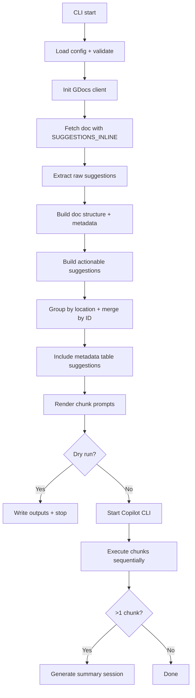

# Bauer architecture (current)

## Architecture (code organization)

At a high level, Bauer is a CLI with three core subsystems: Google Docs extraction, prompt generation, and Copilot execution.

- cmd/bauer/main.go: CLI entry point and the end-to-end orchestrator.
- internal/config: flag parsing + validation for `--doc-id`, `--credentials`, `--chunk-size`, `--output-dir`, `--dry-run`, `--model`, `--summary-model`, `--page-refresh`.
- internal/gdocs: Google Docs/Drive client + extraction pipeline.
  - service.go: auth + API clients.
  - extraction.go: fetch doc, walk document tree, build structure/anchors.
  - grouping.go: group and merge suggestions by location and ID.
  - types.go: data contracts for suggestions, metadata, and structure.
  - comments.go: Drive comments fetch (currently not wired into the main flow).
- internal/prompt: prompt engine + embedded instruction templates.
  - templates/: copy-docs + page-refresh instructions, plus Vanilla pattern references.
- internal/copilotcli: Copilot SDK wrapper to run each chunk and (optionally) generate a summary.

## How the flow operates (implementation details)

A few specifics worth knowing:

- Google Docs is fetched in `SUGGESTIONS_INLINE` mode so insertions/deletions are embedded in the document tree.
- Style suggestions are currently skipped entirely (only insert/delete operations become actionable suggestions).
- Anchor text is generated from the surrounding document text to help Copilot find exact matches.
- Suggestions are grouped first by logical location (section + heading + table), then merged by suggestion ID to form a single change.
- Metadata table suggestions are included; downstream tools should map them via metadata tags in the target repo.
- Chunking is by number of location groups (not “suggestions per chunk”).
- Each chunk file includes: instructions → Vanilla pattern references → JSON suggestions.
- Copilot runs one session per chunk, streaming output to the terminal; summary is a separate session only when there are multiple chunks.

## Understanding the output files

- bauer-log.json: JSON logs (debug-level) for the entire run.
- bauer-doc-suggestions.json: Full `ProcessingResult` (document metadata + actionable + grouped suggestions). Useful for debugging or re-running prompt generation.
- bauer-output/chunk-X-of-Y.md: One prompt per chunk. Each file embeds the instruction template, Vanilla patterns reference, and the JSON suggestions for that chunk.
